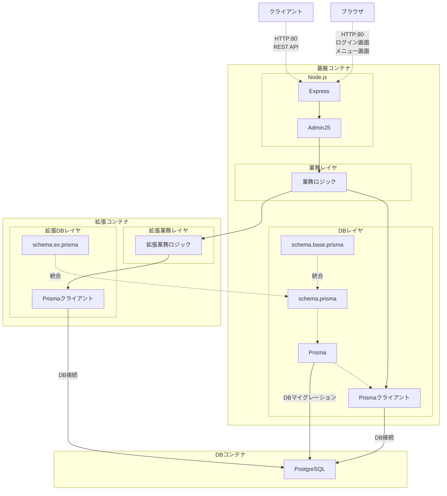

# コンポーネント構成

```mermaid
graph TD
    CL1[ブラウザ]
    CL2[クライアント]
    CL1 -.-> |HTTP:80<br>ログイン画面<br>メニュー画面| EX
    CL2 -.-> |HTTP:80<br>REST API| EX
    subgraph 基盤コンテナ
        EX[Express]
        AJ[AdminJS]
        subgraph Node.js
            EX --> AJ
        end
        subgraph 業務レイヤ
            BZ[業務ロジック]
            AJ --> BZ
        end
        subgraph DBレイヤ
            PR.CL[Prismaクライアント]
            PR[Prisma]
            PR.BS.SC[schema.base.prisma]
            PR.SC[schema.prisma]
            BZ --> PR.CL
            PR -.-> PR.CL
            PR.BS.SC -.-> |統合| PR.SC
            PR.SC -.-> PR
        end
    end
    subgraph DBコンテナ
        PO[PostgreSQL]
        PR.CL --> |DB接続| PO
        PR --> |DBマイグレーション| PO
    end
    subgraph 拡張コンテナ
        subgraph 拡張業務レイヤ
            EX.BZ[拡張業務ロジック]
        end
        subgraph 拡張DBレイヤ
            EX.PR.SC[schema.ex.prisma]
            EX.PR.CL[Prismaクライアント]
        end
        BZ --> EX.BZ
        EX.BZ --> EX.PR.CL
        EX.PR.SC -.-> |統合| PR.SC
        EX.PR.CL --> |DB接続| PO
    end
```
