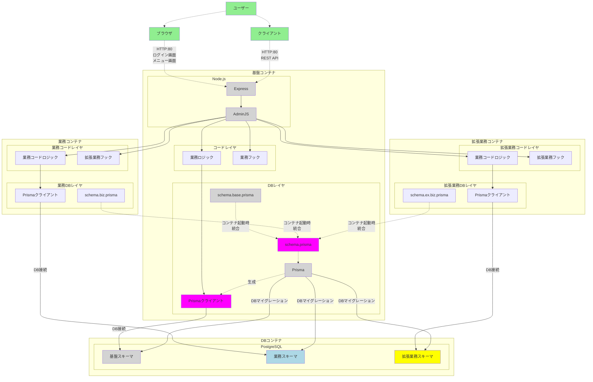

# コンポーネント構成

```mermaid
graph TD
    US[ユーザー]
    CL1[ブラウザ]
    CL2[クライアント]
    style US fill:lightgreen
    style CL1 fill:lightgreen
    style CL2 fill:lightgreen
    US -.-> CL1
    US -.-> CL2
    CL1 -.-> |HTTP:80<br>ログイン画面<br>メニュー画面| ND
    CL2 -.-> |HTTP:80<br>REST API| ND
    subgraph 基盤コンテナ
        ND[Express]
        style ND fill:lightgray
        AJ[AdminJS]
        style AJ fill:lightgray
        subgraph Node.js
            ND --> AJ
        end
        subgraph コードレイヤ
            CD.APP[業務ロジック]
            CD.HOOK[業務フック]
            AJ --> CD.APP
            AJ --> CD.HOOK
        end
        subgraph DBレイヤ
            PR.CL[Prismaクライアント]
            style PR.CL fill:magenta
            PR[Prisma]
            style PR fill:lightgray
            PR.BS.SC[schema.base.prisma]
            style PR.BS.SC fill:lightgray
            PR.SC[schema.prisma]
            style PR.SC fill:magenta
            CD.APP --> PR.CL
            PR -.-> |生成| PR.CL
            PR.BS.SC -.-> |コンテナ起動時<br>統合| PR.SC
            PR.SC -.-> PR
        end
    end
    subgraph DBコンテナ
        subgraph PostgreSQL
            PO[基盤スキーマ]
            BZ.PO[業務スキーマ]
            EX.BZ.PO[拡張業務スキーマ]
            style PO fill:lightgray
            style BZ.PO fill:lightblue
            style EX.BZ.PO fill:yellow
        end
        PR.CL --> |DB接続| PO
        PR --> |DBマイグレーション| PO
    end
    subgraph 業務コンテナ
        subgraph 業務コードレイヤ
            BZ.CD.APP[業務コードロジック]
            BZ.CD.HOOK[拡張業務フック]
        end
        subgraph 業務DBレイヤ
            BZ.PR.SC[schema.biz.prisma]
            BZ.PR.CL[Prismaクライアント]
        end
        AJ --> BZ.CD.APP
        AJ --> BZ.CD.HOOK
        BZ.CD.APP --> BZ.PR.CL
        BZ.PR.SC -.-> |コンテナ起動時<br>統合| PR.SC
        BZ.PR.CL --> |DB接続| BZ.PO
        PR --> |DBマイグレーション| BZ.PO
    end
    subgraph 拡張業務コンテナ
        subgraph 拡張業務コードレイヤ
            EX.BZ.CD.APP[業務コードロジック]
            EX.BZ.CD.HOOK[拡張業務フック]
        end
        subgraph 拡張業務DBレイヤ
            EX.BZ.PR.SC[schema.ex.biz.prisma]
            EX.BZ.PR.CL[Prismaクライアント]
        end
        AJ --> EX.BZ.CD.APP
        AJ --> EX.BZ.CD.HOOK
        EX.BZ.CD.APP --> EX.BZ.PR.CL
        EX.BZ.PR.SC -.-> |コンテナ起動時<br>統合| PR.SC
        EX.BZ.PR.CL --> |DB接続| EX.BZ.PO
        PR --> |DBマイグレーション| EX.BZ.PO
    end
```
